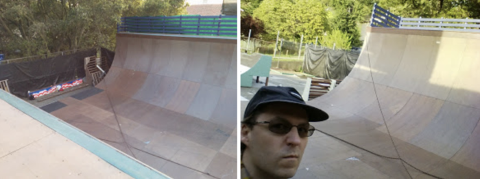

# The UC Berkeley Vert Ramp

Yes, the University of California at Berkeley owns a full on vert ramp!  I was a skateboarding graduate student at Berkeley 1995-2000 (where I earned a Ph.D. in mathematics), and they built this ramp... in 2001!  Seriously.  The whole time I lived there I only skated street; fortunately, street in the late 1990s in the San Francisco Bay Area was awesome.

I've only really skated this ramp once, and I had a significant injury to my calf muscle at the time (and was also visiting Barry Mazur in 
Berkeley to finish writing [this book](https://wstein.org/books/rh/)).   The session and vibe that one time was awesome.

A unique feature of this ramp is a metal strip along the coping on both
sides, which makes the transition from ramp to coping perfect, and also
makes it very easy to see the lip.

They are very serious about not letting you skate this ramp except
when they are having an official session.

The ramp is on the Clark Kerr part of campus (where other athletic facilities are), and is visible from the street.

  

Here's a video I found that shows off the ramp:

<iframe src="https://player.vimeo.com/video/48728739" />
