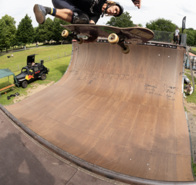

# The Bonn Vert Ramp

- [This article](http://www.confuzine.com/2019/06/25/bonn-bash-vert-contest-2019/) says "The Halfpipe is existing since more then 27 years now at the same location, Rheinaue, Bonn. So it is the oldest continuous halfpipe spot in Germany."

- [More pictures...](<- https://blog.skateboard.com.au/skateparks/germany/bonn-vert-ramp/>)

---

Incidentally, I once lived in Bonn, Germany for a few months in 2001
for my first academic postdoc (at the Max Planck Institute there)
as a mathematician. When I was there a large temporary vert ramp mysteriously
appeared right around the corner from the Institute. Unfortunately,
I don't have any pictures...
