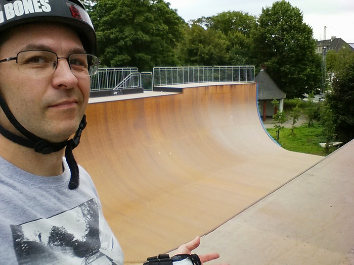
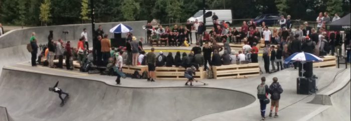

# Copenhagen's public vert ramp

Here's a picture of me about to skate this ramp in August 2014. I was there for a few weeks because of a [mathematics conference](https://wiki.sagemath.org/days61) across the street!

Rune Glifberg was there that day filming a sick line using a drone (he kept trying to shoe me off the ramp so I wouldn't "mess up" the shot).

The vert ramp is in a public skatepark that also has some concrete bowls. Completely by coincidence there was a huge contest there when I was there, with many top bowl pros of 2014. I mainly remember Sky Siljeg representing, and Austin Poynter blasting (but almost never landing) ridiculously huge airs on a relatively small concrete
bowl.

### Other

- [Article about the ramp opening in 2012](http://ramp-riders.com/portfolio/europes-biggest-vert-ramp-2012-copenhagen/)
- https://www.kobenhavnergron.dk/place/faelledparken-skatepark/?lang=en