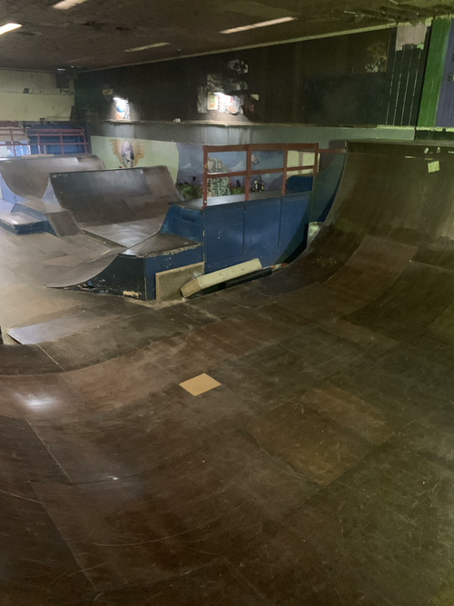
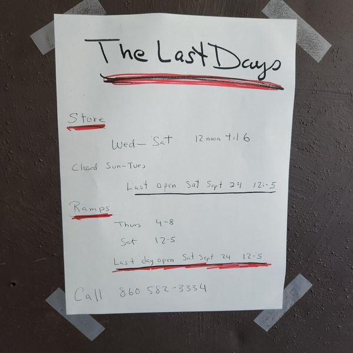

# CT bike and indoor skatepark - world's oldest indoor vert ramp

[CT bike and indoor skatepark](http://ctbike.com/) in Bristol, Connecticut
has the world's oldest indoor skatepark and vert ramp.
It was built in 1987 and is still skated, over 3 decades
later!

Specs: 24’ wide, 9 1/2 - 10’ tall, 16’ flat, 9’ transitions.

The people who own the park are getting up in age and I'm
not sure how this place can be revamped and preserved for the
future.

Watch the video below to see that this ramp is HARD CORE!!

<iframe src="https://www.youtube.com/embed/CbPyaGTSx3k"/>

## UPDATE - closing for good on Sept 24th, 2022

From mrferris2u:

> "I was just there today looking to start skating vert.  They're closing for good Sept 24th.  Apparently looking for a buyer."

