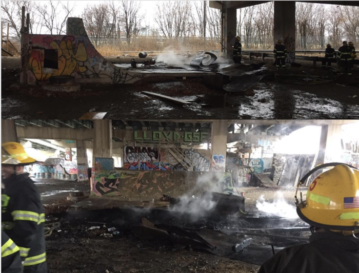

# FDR Skatepark vert ramp

The surface was rough steel. There's a huge DIY concrete park here too.

- [Wikipedia page](https://en.wikipedia.org/wiki/FDR_Skatepark)

The ramp evidently [burned to the ground](https://www.inquirer.com/philly/news/Fire-Jan-23-2017-FDR-skatepark-ramp-burned.html) in 2017.  I don't know if any repair work ever happened.

