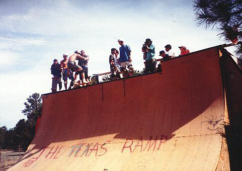
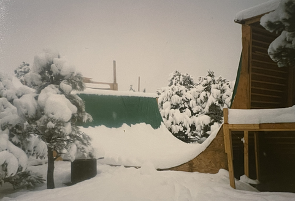

# The "Texas Ramp" in Flagstaff, AZ (1989-1991)

This was a ramp that I first built in 1990 in Flagstaff, AZ.  It got moved and rebuilt multiple times by my brother Dennis Stein.  Finally, it was disassembled and lived out its final days as a pile of wood next to [Brian Harper's](https://www.linkedin.com/in/brian-harper-8021b78) AZP skatepark
(Brian ended up building many world famous vert ramps over the years at [California Skateparks](https://www.californiaskateparks.com/meet-the-team)!).  it was called "The Texas Ramp", because I moved to Flagstaff from Texas right before building this ramp, and I had a strong Texas accent at 
the time.

Specs: 24' wide, 10.5' tall, 1' vert.   It also had 8' wide extension and de-extension.

 
It snows in Flagstaff AZ, at 7000 feet.  We built a miniramp under the deck, so we could skate when the ramp was covered in snow:
