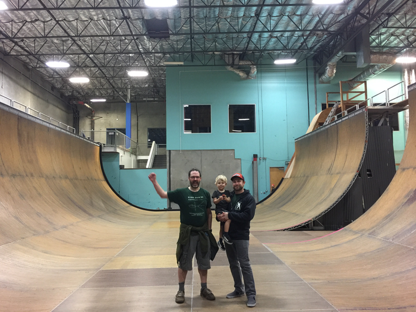
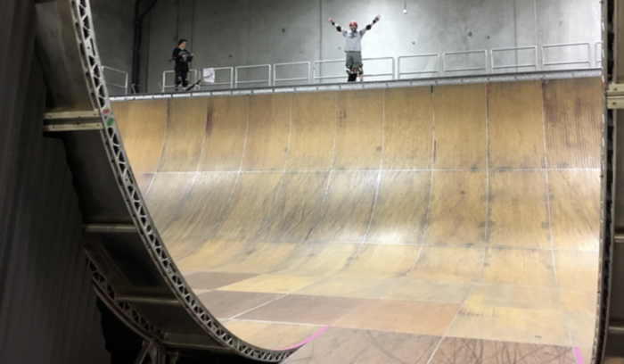

# Tony Hawk's Birdhouse Ramp

There's a warehouse in Vista, CA that contains one assembled
vert ramp, and one vert ramp in pieces.  These were the two
steel framed ramps that were used in the traveling "Tony Hawk 
Boom Boom Huck Jam" two decades ago.   I skated there once,
and was told the disassembled ramp is so bent out of shape that
it can't be put back together again.

The surface of the ramp was hardwood "beech" for a long time.
I think it's now skatelite, as of 2019?

Ryan Spence, Jacob Spence and me at Hawk's Ramp Jan 2018, when it had a wood surface:

  

Adam Taylor and I at Hawk's in Jan 2018:

