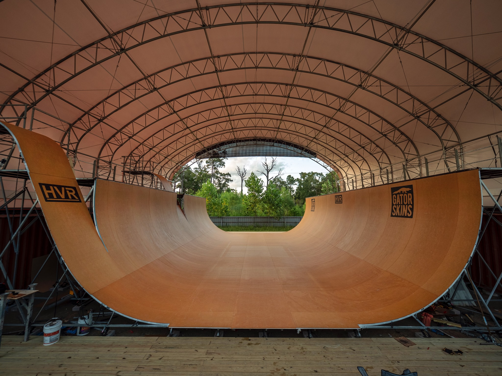

# The Houston Vert Ramp

- Specs: 13' x 60' G-Ramp, 2' of Vert, 18' Roll-ins and a 5' Channel
- Surface: with Gator Skins, 5' x 12' sheets, 1/16th Round-Over, Diamond screw pattern.

Email: <a href="mailto:skate@houstonvertramp.com">skate@houstonvertramp.com</a>

