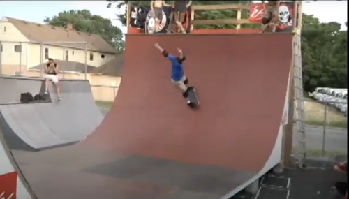

# The Keyholders Ramp

**Update May 7, 2022:** *"I called them up a few minutes ago they said all the Ramps out back got torn down over the winter...."* - Rik Rule

  

> "Built by [Rich Pond](/ramps/pond/) and Zach Lewis (of [vertkeley / UC Berkeley](/ramps/berkeley/)).   Located at [Rainbow Roller Rink](https://rainbowrink.com/) in North Tonawanda, NY. It's 5 dollars to skate. Formally known as 'keyholders ramp'."   
>
> My buddy Carlos facilitated the whole thing.  We got kicked outta the warehouse we had it set up in, so Carlos donated it to the roller rink.

Specs: It's 50' long. 18' wide. 11' tall. 9 1/2'tranny 1 1/2' vert.

<iframe src="https://www.youtube.com/embed/oW93c65ccpU"/>