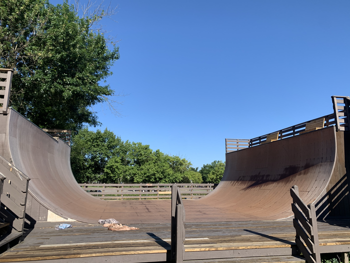

## **Update \(July 10, 2022\)**

> _"Just wanted to let you know that the vert ramp at Laurel skatepark in Richmond VA has been torn down._
>
> _The pool no longer exists either. Both have been concreted over and replaced with assorted skate park elements._
>
> _Thanks for putting together the list of vert ramps,_
>
> _Ron"_

## The Ramp

There ~~is~~ was a public vert ramp at the [Laurel skatepark](https://henrico.us/rec/places/laurel/) outside ofRichmond VA in Henrico County. It was built in 1990.

Specs: It’s 10’ high by 32’ wide with a 6” extension on one side.  Jeremy reports

> "I believe the specs are 8 1/2’ transition with 18” vert, because it's about a board's wheelbase of vertical."

- Surface: Skatelite

---

## Videos

<iframe  src="https://www.youtube.com/embed/ncDUWeJBeX4?start=37" />

<iframe src="https://www.youtube.com/embed/TB2vnErXByQ?start=14" />

