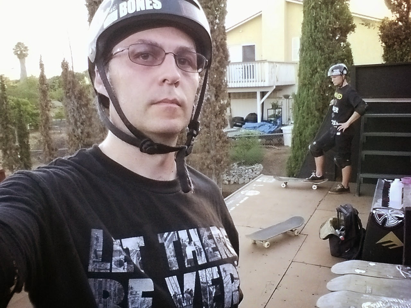
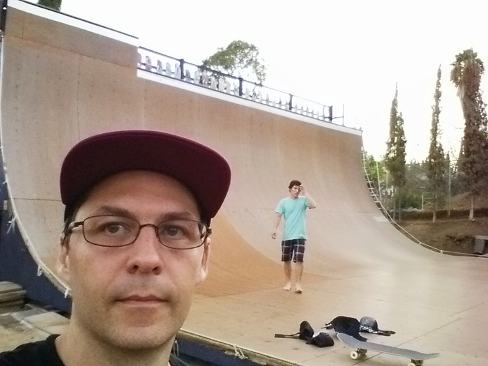

# The Bteam Ramp: Evando Mancha's vert ramp

The Encinitas YMCA used to have a huge old X-games vert ramp.
They chopped it in half to make room for a bunch of smaller 
concrete features, and this is the half that left.

I've skated it a few times, and every session was **awesome**.  Here
is me doing my best [Paul-luc Ronchetti](https://www.instagram.com/plronchetti/?hl=en) impersonation while rocking my Seattle Vert Ramp shirt (the real PLR is standing right behind me):

  
Here's me and Ryan Hass after a session; this picture gives a good
sense of the scale of the ramp.  It's terrifying to climb a ladder to
get up the pictured side of the ramp, whereas the other side has a nice 
staircase.

  
<iframe src="https://www.youtube.com/embed/z7HWRToiOxE" title="YouTube video player" frameBorder="0" allow="accelerometer; autoplay; clipboard-write; encrypted-media; gyroscope; picture-in-picture" allowFullScreen></iframe>

## Links

- [Instagram page](https://www.instagram.com/bteam_ramp/)
- [Vertskateboarding](http://vertskateboarding.com/profiles/skater-contributors/evandro-mancha-menezes/)