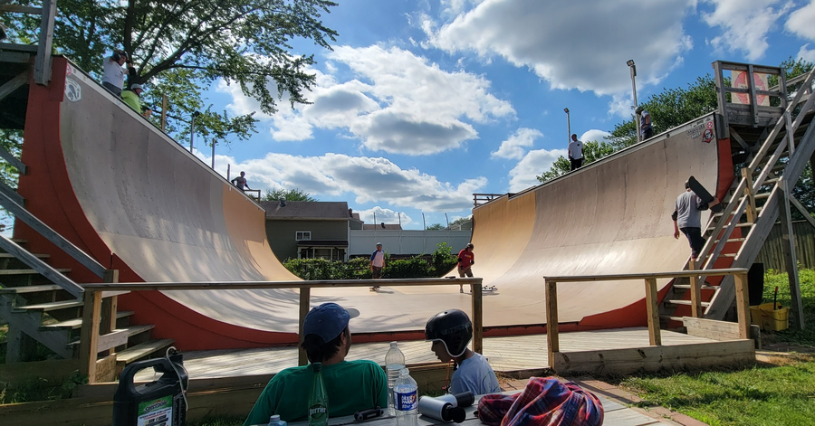

# The Orange Peel Ramp in Maryland

This is a private ramp owned by Steve Hauck that is 13' tall, with 2' of vert. It has
an extension (height and width?). It looks like it's about 60' wide
according to [this video](https://www.instagram.com/p/CVF0_olgcBh/).
Rumor has it that it was built in 2019.

