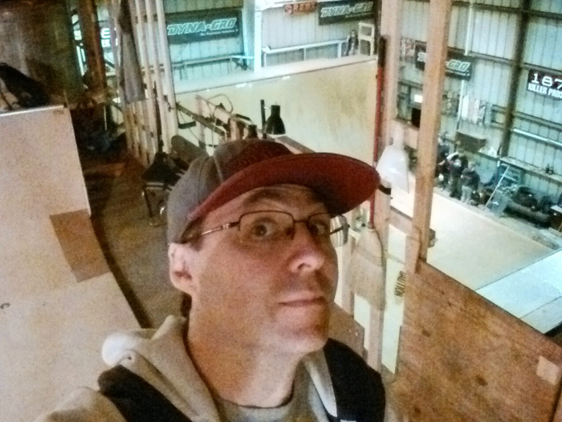
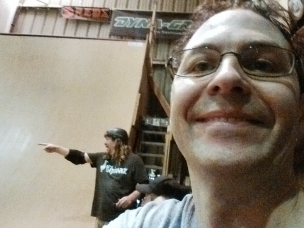

# The Richmond Vert Ramp

This is a vert ramp in a warehouse in Richmond, CA. I've skated it
a couple of times with Jeff Hedges and my brother, and it's always
been an awesome session.

The surface is **masonite**, and this is an example that shows that
masonite is still a viable (indoor!) ramp surface.
The ramp used to be taller but was
cut down to reduce the amount of vert. There's a really cool miniramp
spine in the attic as well.

It's very much a private ramp, with sessions happening every once
in a while when the owner is fully available.

---

Here's a picture of me there in Nov 2014, about to skate with
Jeff Hedges and the crew:

 

Jeff shows me the way:

