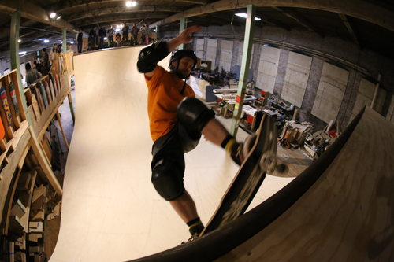
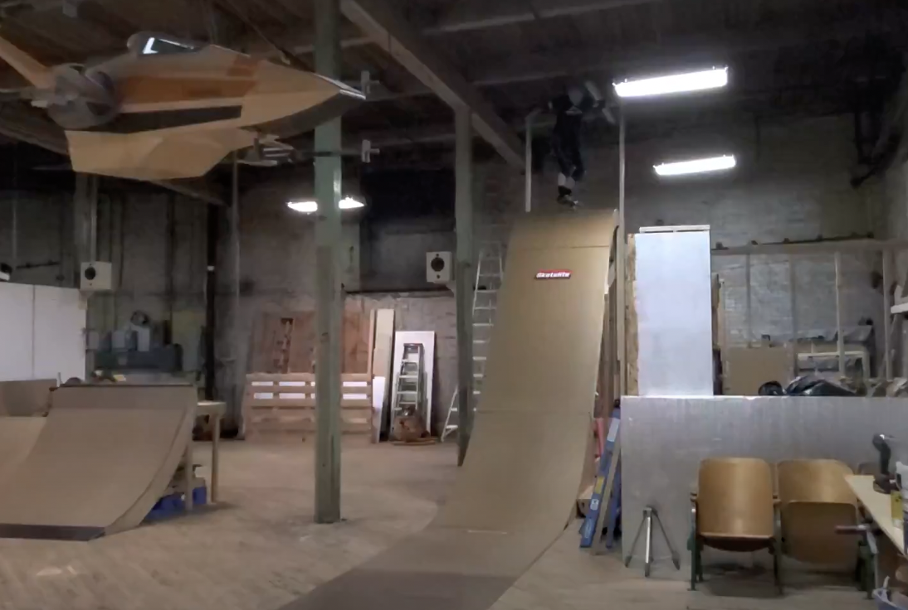
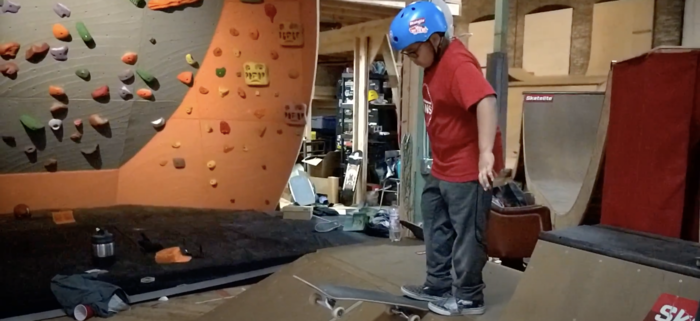

# Ryan Spence's

[Ryan Spence](https://www.linkedin.com/in/ryan-spence-1908211a5) has a private warehouse in Tacoma, WA, and here he is doing a front side grind on his vert ramp.

Ryan's warehouse contains a 20' wide 11' vert ramp with a fast dry birch surface, a spine mini ramp with several heights and corners, another 4' mini ramp, first class climbing walls with a large number of experimental holds, a mini mega ramp, a photo studio, and much more.  Here's the drop in to the mini mega:

 

You can also see a spine and climbing wall here:

