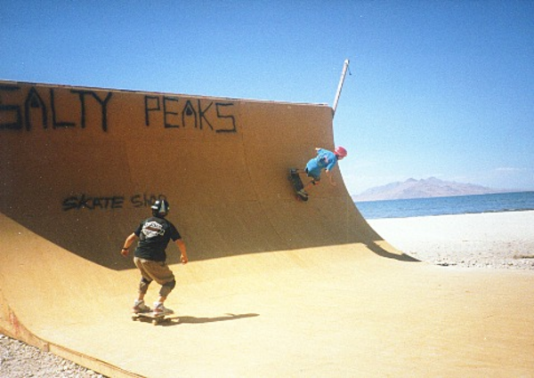
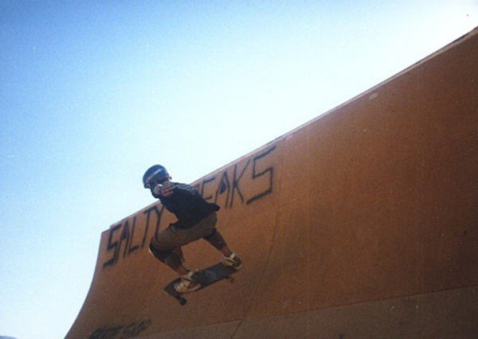

# Salty Peaks Vert Ramp near Salt Lake City, Utah

Sometime in the late 1980s my family were driving from California
to Texas, and my dad spotted a vert ramp on a beach near Salt Lake.
Nobody was around, so we drove up to it, and my brother and
I skated it!  This was some Animal Chin level awesomeness.
Here's two pictures.

From the spray paint on the ramp, it was probably built by the [Salty Peaks Snowboard Shop](https://www.saltypeaks.com/).

Please email me if you have any more information about this ramp!