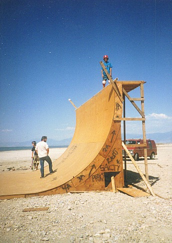
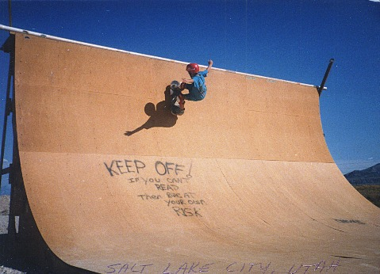
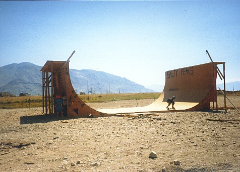
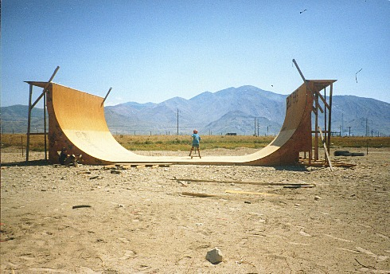
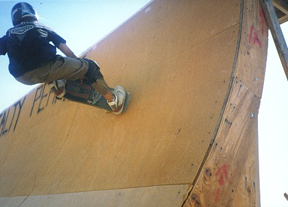
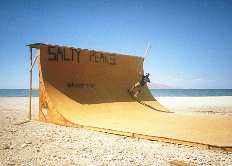
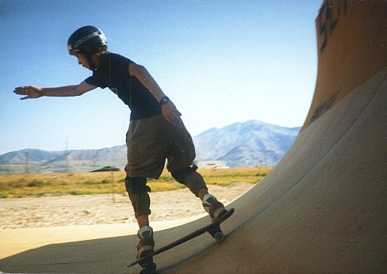

# Salty Peaks Vert Ramp near Salt Lake City, Utah

Sometime in the 1980s my family were driving through Utah, and my dad spotted a
vert ramp on a beach near Salt Lake. Nobody was around, so we drove up to it,
and my brother and I skated it! This was some Animal Chin level awesomeness.
Here's two pictures.

 

From the spray paint on the ramp, it was built by the [Salty Peaks Snowboard Shop](https://www.saltypeaks.com/), I think in 1987.   I contacted them and they provided more details:

> _"Hey,_

> _Yeah this was a ramp that was built for **Salt Air**! It was built in July around 82. It took a semi truck to bring the ramp out there for a competition. A couple of the guys were putting the pieces together and right when they got the main frame up must have been when those pictures were snapped because later on a railing was put on around the top and a big banner was flown from the backside of the ramp. During the competition there were around 15 cops standing in the front holding people back from the ramp while the crowd watched back and forth as riders dropped in. At the time it was the largest ramp in the country. Unfortunately it was smashed by the wind; picking up one side of the ramp and blowing it into the otherside. When the crew went to go and salvage the ramp the next day the other half of the ramp blew in on itself._ 

> _If you find any other pictures Dennis (Salty Peaks Owner) said to shoot hi another message been awhile since he had seen it._

> _Thanks, Nick"_

## More Pictures!

