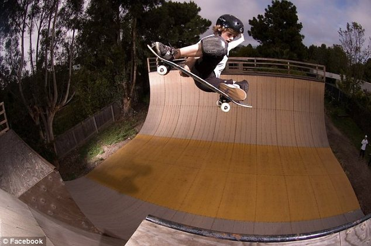

# Tom Schaar's backyard vert ramp

This ramp exists, or once existed, somewhere in the LA area:

 

I don't know anything more about it than what you see
in the 2012 picture above. I did once skate with
Tom Schaar at the combi bowl when he was 12 years old
and not yet famous, and we talked a few times. I told
him if he could land that 720 he was trying, it would
be the first one I've ever seen in real life... and sure
enough he stuck it.
