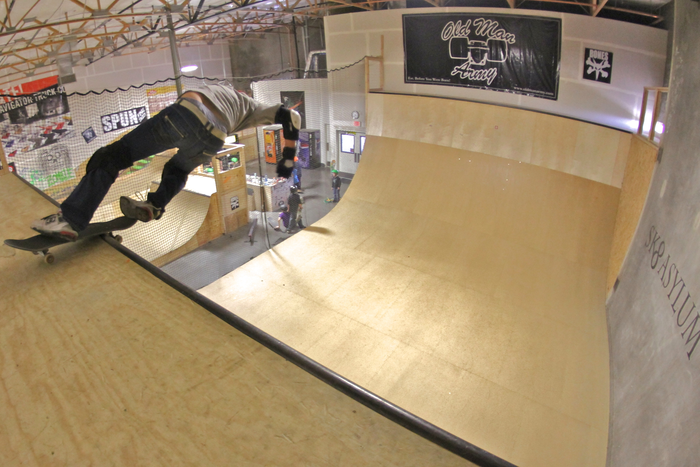

# The Skate Asylum Vert Ramp

This was a vert ramp in a warehouse somewhere east
of Phoenix, Arizona.
I skated on June 5, 2011, bought a cool T-shirt there, and slammed pretty
hard.
This ramp is long gone, but it was fast and fun.

Here's a picture of me doing a rock-n-roll and a feeble fakie:

 

- [Dan's page has some more great photos](https://www.northwestskater.com/sk8asylum.html)
