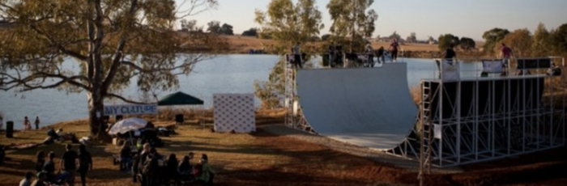

# The Midrand South Africa Vert Ramp

There is or was a vert ramp in Midrand, South Africa.

Specs: 12.5ft tall (11.5ft tranny, 1ft Vert).

[Pictures...](https://www.concretedisciples.com/global-skatepark-directory/south-africa/the-vert-ramp-midrand-south-africa/)

Status? The official website for the ramp was at https://WWW.VERT.CO.ZA, but
it has vanished.
