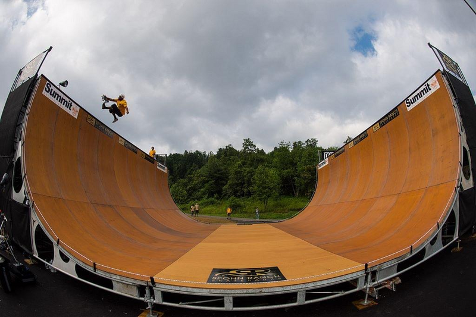

# The Summit Bechtel Reserve

> "There’s ramp at The Summit Bechtel Reserve in Glen Jean, West Virginia. It’s kind of a bummer cause it’s private and usually only open every few years to Boy Scouts. However, an action sports organization called Camp Royal made a partnership with them last year to skate their skatepark. I believe it was 14ft, but I also skated it when I was a kid in 2013, so I’m not sure the exact dimensions." -- Alex

