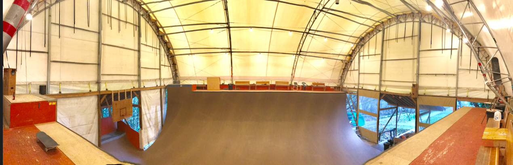

import Donate from "components/donate";

# Seattle Vert Ramp

Seattle Vert Ramp (SVR) is our ramp pictured above, which we built in 2012.  We still skate this backyard vert ramp all the time, and _if you are a vert skater in the Seattle area, come on by for a session!_
If you skate regularly, you can donate to help support longterm ramp maintenance, electricity, etc.:

<Donate />

SVR is 56' wide, 13.5' tall with 2' vert.  It also has two 8' wide 15.5' extensions (for 4' of vert).  It's surface consists of four layers of plywood and 1 layer of [Skatelite](https://www.skatelite.com/) laid diagonally at an angle with all edges rounded.   It's covered with a 15,000 pound [ClearSpan](https://www.clearspan.com/) roof, which is set directly on top of the ramp itself.

The ramp was designed and construction led by [Ryan Spence](https://www.linkedin.com/in/ryan-spence-1908211a5) who 
also built [his ramps in Tacoma](/ramps/ryan/).

Unlike the other ramps on this website, this ramp is ours (!), and I've skated it thousands of times.  Here'a a video where I did 43 tricks at SVR on my 43rd birthday.

<iframe src="https://www.youtube.com/embed/-5FbvrRzHak" title="YouTube video player" frameBorder="0" allow="accelerometer; autoplay; clipboard-write; encrypted-media; gyroscope; picture-in-picture" allowFullScreen></iframe>
