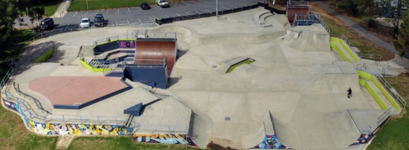
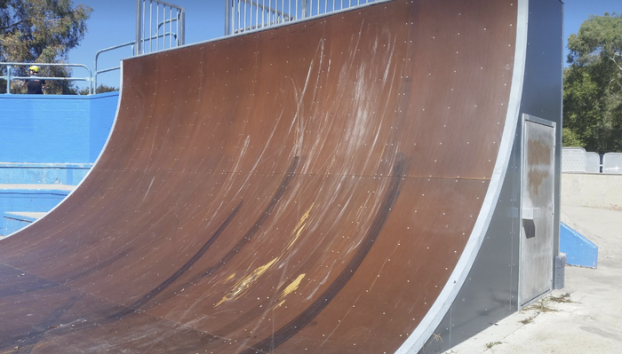

 

> My local vert ramp is roughly 11 foot high 23 foot wide.
> It was steel from 1992 until 2017 when it got a face lift
> and is now sheeted in a SkateLite-type product made in oz
> called hARD. There is a 9 foot almost vert ramp as well.
> The ramp is in a part of Canberra called Tuggeranong, Australia.

The ramp was sessioned by a car a month after it was resurfaced.

## Links

- https://skatermaps.com/tuggeranong-skatepark/
- https://www.facebook.com/TuggeranongSkatepark/
- http://skatin.it/tuggeranong-skatepark/

## Videos

- New skatelite:

<iframe src="https://www.youtube.com/embed/1y-q7hB7zyI"/>

- When it had a steel surface:

<iframe src="https://www.youtube.com/embed/VWeWUmUq22U"/>